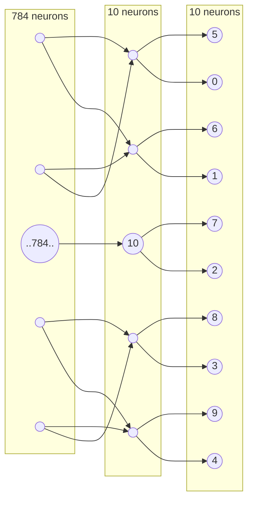

# Custom MNIST digit classification Neural Network

Today I've decided to build a custom NN for digit classification without any libraries like PyTorch or TensorFlow and get around with **numpy** only !🚀 
Idea behind the project is to learn how neural networks work behind the since: math, forward/backward propagation, etc.

Here I am using MNIST dataset which can be downloaded from: [kaggle](https://www.kaggle.com/competitions/digit-recognizer/data)

## Dataset structure:

**28x28** images all labeled **0-10**

## Neural Network Structure

**1. Input Layer**
- 784 neurons (each representing the 28x28 image)

**2. Hidden Layer**
- 10 neurons 

**1. Output Layer**
- 10 neurons (represents the final prediction: neurton per one of 10 digits)

## Results
In my case, I achieved **91%** accuracy!

## Further considerations
- More than single epoch
- Use Mini-Batching approach

For this project, I have opted to keep the implementation straightforward without these optimizations. However, I plan to incorporate them in future projects.

Next, I plan to develop a **plane vs bird classification NN**! Once it's completed, I will drop link here: <...>
